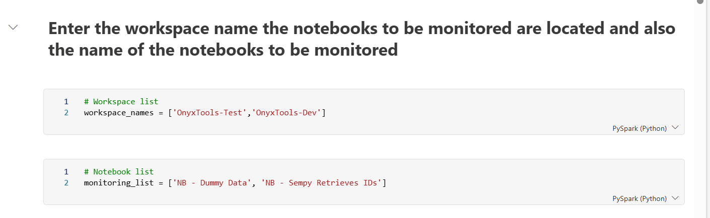
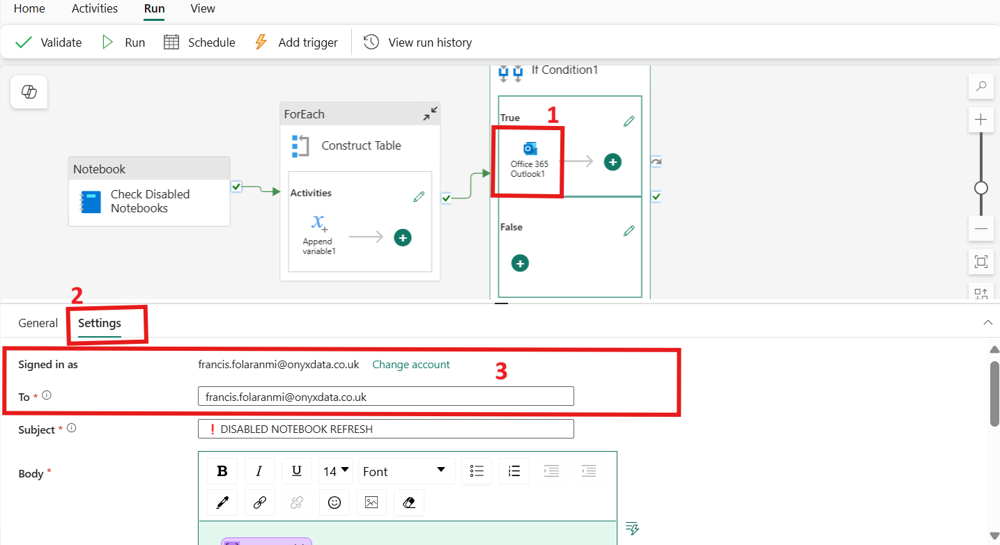

## **How to use:** 
To use this tool,
- Edit the notebook, add the workspaces the notebooks are located and also add list of critical notebooks to be monitored.

See Below: 
- 

- Edit the pipeline, select the outlook activity, go to settings tab, sign in the outlook activity, allow access and add email(s) to be notified, 

See below:

**to send notification to multiple emails, separate with ";" for example:** 

`john.doe@onyx.com;rice.white@onyx.com;green@onyx.com`

- After the edits, schedule the pipeline to run at suitable frequency

## **See Also**

- [Discover more about this tool](../Onyx-Tools/disabled-notebook-alert)
- [Home](../Setup)
