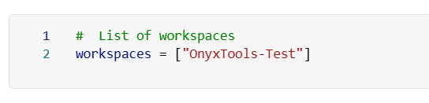
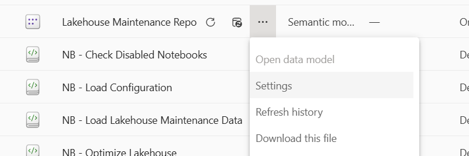
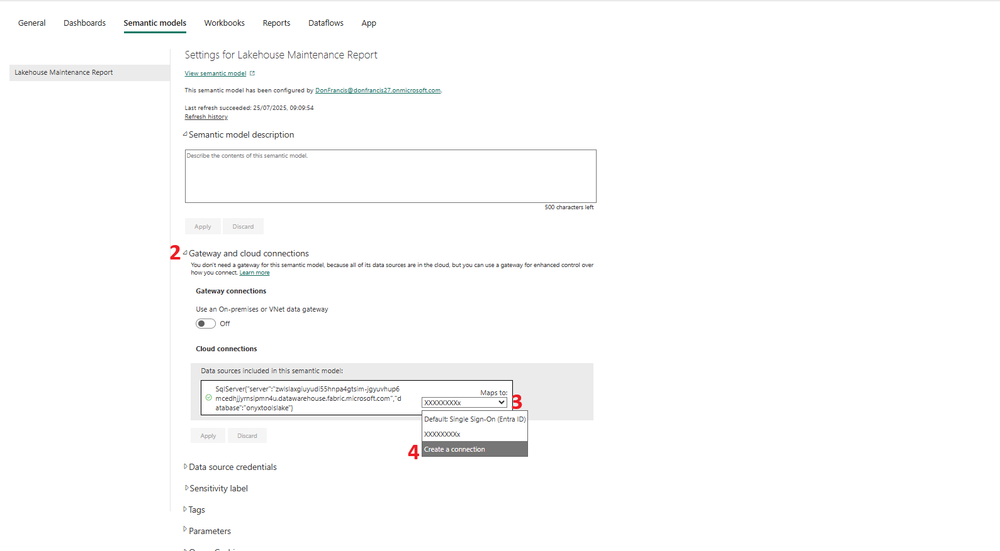
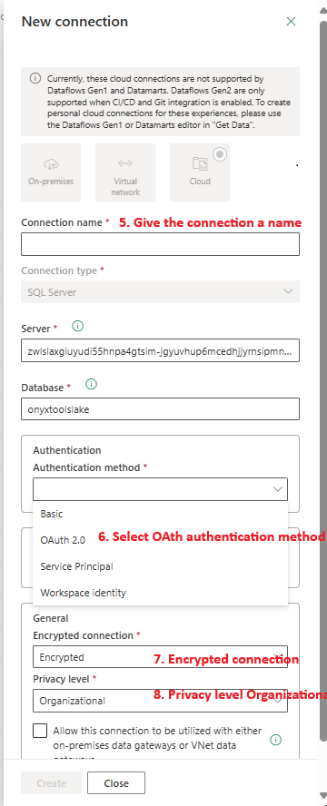
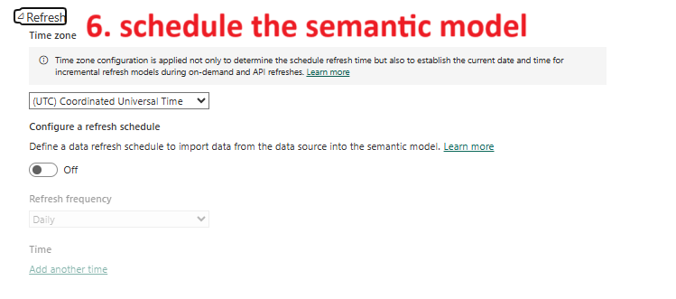

# 🧹 Lakehouse Maintenance Tool – How to Use

## **What it is:**

Every Fabric Lakehouse uses **Delta tables**, and over time, these tables accumulate metadata and small data files that **degrade performance**, increase storage usage, and can even cause **SQL Endpoint failures**.

This tool helps **automate essential Lakehouse maintenance** by:
- Running `OPTIMIZE` to compact small files and improve query performance
- Running `VACUUM` to remove outdated data files and free up storage
- Collecting **performance baselines** of top queries (by execution count, duration, and scan size)
- Capturing metadata about each table (number of files, total size, and row count)

This regular housekeeping ensures a **healthy SQL Endpoint environment**, and minimizes the risk of stale, fragmented, or slow queries.

> ℹ️ You can optionally integrate this tool with the **SQL Endpoint Refresh Tool** to ensure query results reflect the latest optimized and ingested data.  
> _(Insert link to that tool’s documentation here)_

---

## **How to Install:**

Please follow the [setup instructions in `setup.md`](./setup.md) to install the tool and its dependencies.

This will also install the **Lakehouse Maintenance Report**, a Power BI report used to visualize and analyze the metadata and performance data collected by this tool.

---

## **Configuration steps:**

1. **Open** `NB - Optimize Lakehouse` **notebook**

    *   In **cell 1**, enter the **Workspace name** and **Lakehouse name** that need to be optimized.

2. **Open `NB - Performance Baseline` notebook**  
   - Go to **cell 2** and replace the `WorkspaceId` and `SQLEndpointId` with the correct IDs for your environment.  
   

3. **(Optional) Adjust filters or logic in the notebook** if you'd like to focus on specific query types or time periods.

4. **Open `NB - Load Lakehouse Maintenance Data` notebook**  
   - This notebook loads and organizes metadata produced by the two other notebooks for use in the Lakehouse Maintenance Report.
   - The performance queries retrieve semantic models and reports by their Ids. It tries to translate the names by checking the workspaces you choose
   - In code cell 4, define the name of the workspaces where you would like the code to check for the translation of semantic models and report ids

5.  **Schedule** `**NB - Optimize Lakehouse**`
    *   Recommended to run during off-peak hours, e.g., **8 AM every Monday**.
6.  **Schedule** `**NB - Load Lakehouse Maintenance Data**`
    *   Run this after the Optimize notebook completes, e.g., **9 AM every Monday**.

## **Semantic Model Configuration steps:**

The semantic model for the lakehouse optimization report needs to be configured, so you can access the report about the maintenance and optimization executions.

1. **Go to the Lakehouse Maintenance Report Semantic Model and open Settings**

2. **Open the option Gateway and Cloud Connection**

 

3. **In the drop down close to the connection, choose Create New Connection**

4. **In the New Connection window, give a name to the connection**

 

5. **Choose the authentication method as Oauth 2.0**
 
    - You can choose other options, but the configuration will be up to you.

6. **In General, leave Encrypted Connection as "Encrypted"**

7. **In General, leave Privacy Level as "Organizational"**

8. **Create the connection object**

9. **Back to Gateway and Cloud Connection, ensure the connection you just created is selected**

## **Schedule the Semantic Model**

We strongly recommend to schedule the refresh of the semantic model

1. **Access the semantic model settings**

2. **Under Refresh, turn on the schedule**

 

3. **Choose the schedule frequency**

    - We recommend to make the frequency according to the frequency of the notebooks execution

---

## **How to use it:**

1. **Schedule `NB - Optimize Lakehouse`**  
   - Recommended to run during off-peak hours, e.g., **8 AM every Monday**.

2. **Schedule `NB - Load Lakehouse Maintenance Data`**  
   - Run **after** the Optimize notebook finishes, e.g., **9 AM every Monday**.

3. **Schedule or run `NB - Performance Baseline`**  
   - Can be run manually or periodically (e.g., once a month) to evaluate query behavior over time.

4. **Use the Power BI report (`Lakehouse Maintenance Report`)**  
   - This report (installed during setup) helps you:
     - Visualize table size growth and file fragmentation
     - Monitor which queries are consuming the most resources
     - Detect tables or endpoints that require more frequent maintenance

---

## **Tips & Notes:**

- ✅ This tool is **non-disruptive** when scheduled wisely — avoid overlapping with ingestion jobs.
- 🔍 Metadata and performance logs can help with **scaling**, **troubleshooting**, or **auditing**.
- 📊 Use the report to **track the health of your lakehouse over time** and catch problems before they affect business reporting.
