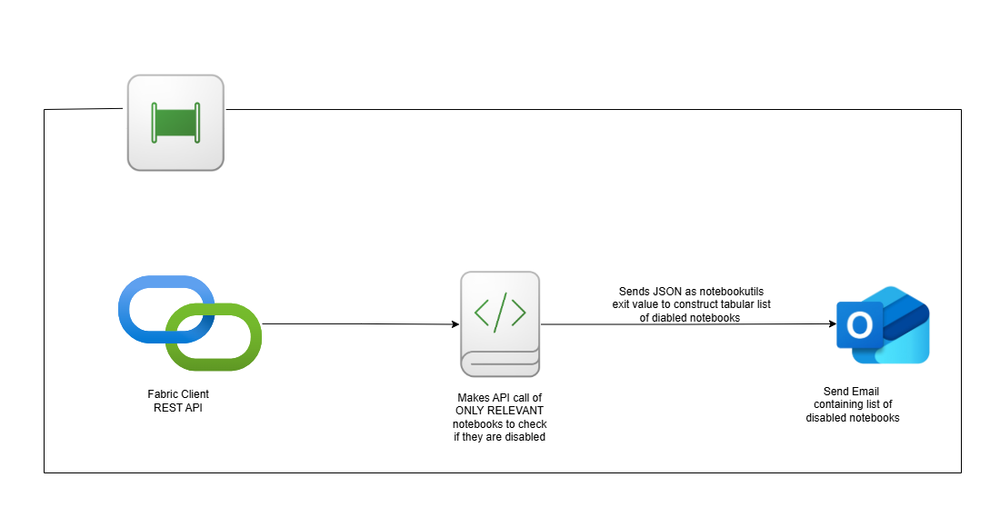

# 🚨 Disabled Notebook Alert – When and Why

## Problem

Microsoft Fabric automatically disables a scheduled notebook after **four consecutive execution failures**. This silent disablement can go unnoticed for days or weeks—especially if the job is expected to run infrequently.

Additionally, alerting on every single failure is **not feasible**:
- Many errors are transient (e.g., memory pressure, service blips, momentary schema issues).
- Daily alerts on these transient issues would lead to **alert fatigue**, making teams ignore or filter out important messages.

## Why this tool matters

This tool takes a smarter approach:
- **It doesn’t alert on every failure**, but only when a notebook becomes disabled due to repeated failures.
- Prevents unnoticed stoppage of critical jobs without overwhelming your team with noisy alerts.

## Architecture

- The data pipeline triggers a notebook
- The notebook uses Fabric API to check if the schedule of monitored notebooks are enabled
- An alert message is prepared and set by email if there are schedules disabled

## See Also

- [Setup the tools](setup.md)
- [Configure Lakehouse Maintenance](../Documentation/Solution-Overview/Productionalized-Items/How-to-Set-Up-Documentation/Notebook-Disabled-Monitoring-Tool.md)
- [Home](../README.md)

## When to use it

- Deploy this tool to monitor production notebooks with schedules.
- Run it at least once per day, or after key execution windows.
- Integrate with existing alerting systems like email, Teams, or a Fabric dashboard.
