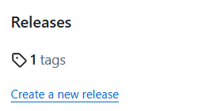
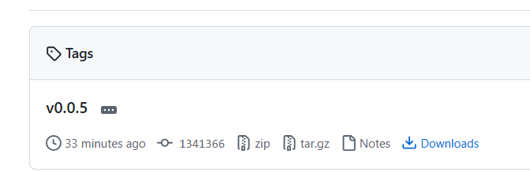
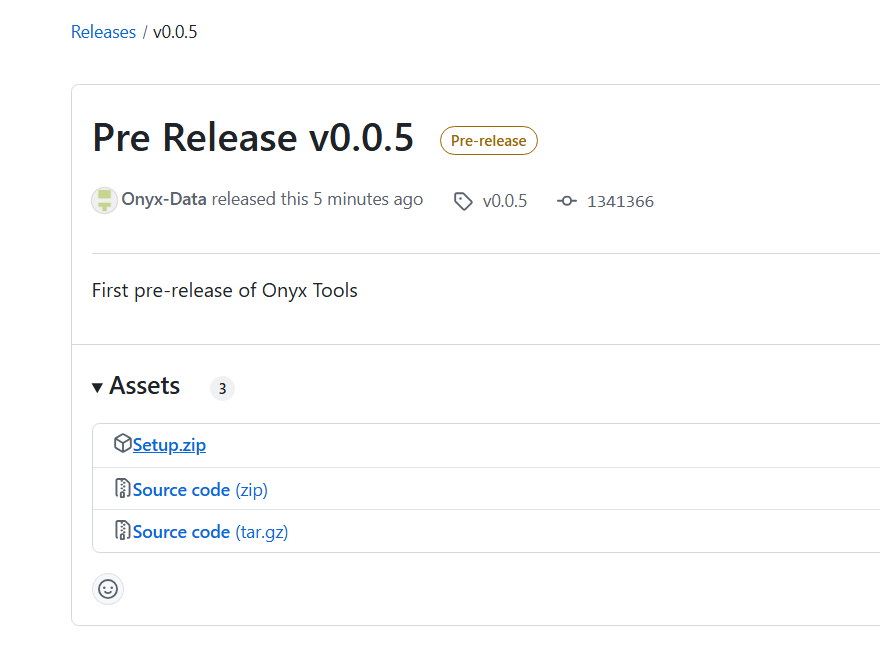

# Setup Instructions for Microsoft Fabric Tools

This guide explains how to install and set up the Microsoft Fabric Tools on your local machine.

---

## 📋 Prerequisites

Before running the setup, make sure you meet the following requirements:

### ✅ PowerShell 7

These tools require **PowerShell 7** to be installed. PowerShell 5 (the default on many Windows systems) is **not supported**.

Follow the instructions in the official Microsoft documentation to install PowerShell 7:

👉 [Install PowerShell 7 on Windows](https://learn.microsoft.com/en-us/powershell/scripting/install/installing-powershell-on-windows?view=powershell-7.5)

> ⚠️ Be sure to choose the **MSI** installer for Windows and run the installer as **Administrator**.

---

## 📦 Downloading the Tools

Go to the GitHub Releases page and download the latest version of `setup.zip`.







After downloading:

1. Locate the downloaded `setup.zip` file.
2. **Extract** its contents to a known location on your machine, such as `C:\FabricTools`.


---

## 🛠️ Running the Setup

To install the tools:

1. **Open a Command Prompt** as Administrator:
   - Press `Windows`, type `cmd`, right-click **Command Prompt**, and select **Run as administrator**.

2. **Navigate to the folder** where you extracted the tools:
   ```cmd
   cd C:\FabricTools
   ```

3. **Run the setup script**:
   ```cmd
   setup.bat
   ```

This script will:
- Detect and verify PowerShell 7.
- Automatically install the Microsoft Fabric CLI (`fab`) if not already installed.
- Set up environment variables or aliases needed to run the tools.

---

## ✅ After Setup

Once setup completes, you can start using the tools. Each tool includes its own README and usage documentation here in the repository

---

If you run into any problems, please check the Issues section on GitHub or open a new one for support.
